# K8s sandbox

## Table of Contents

* [Roadmap / Tasks](#roadmap--tasks)
* [Tecnologies](#tecnologies)
* [Requirements](#requirements)
* [Installation](#installation)
* [Data Flow](#data-flow)
* [File Structure](#file-structure)
* [License](#license)

## Roadmap / Tasks

* services
  * Go
    * http rest server
    * Gin
  * Python
    * FastAPI
    * Flask
  * JavaScript:
    * Express
    * Fastify


* test
  * curl / bash
  * go test
  * pytest
  * jest

* service level
  * schemas
  * fake data models
  * routes
  * entry points
  * static configs

* Databases / Entities Storage
  * PostgresSQL
  * MySQL
  * MongoDB
  * Redis
  * JSON
  * XML
  * CSV

* service level 2
  * connectors

* packages
  * schema packages
  * connectors packages 
  * entities packages
  * named queries packages

* clients (desktop)
  * cli - go

* services
  * Django - Python
  * NestJS - TypeScript

* static
  * react (vite + TypeScript)
  * Vanilla JS (HTML + CSS + JS)
  * Vanilla TS (HTML + CSS + TS)
  * Vue
  * SolidJS
  * Angular
  * Svelte

* packages
  * api sdks (controllers)
    * JavaScript
    * TypeScript
    * Python
    * Go

* services
  * NextJS - TypeScript

coming soon

## Tecnologies

* Docker
* Docker Compose
* Kubernetes
* minikube
* yamllint
* shellcheck

## Requirements

* qemu
* minikube
* Docker
* kubectl
* resolvconf
* yamllint
* go
* kube-linter
* shellcheck

## Installation

1. Run the following command for edit the file `/etc/hosts`:

```bash
sudo nano /etc/hosts
```

Add the following line:

```txt
127.0.0.1  host.minikube.internal
```

## Ports Conventions

| Port  | Description |
| ----- | ----------- |
| 8000  | Service     |
| 27017 | MongoDB     |

## Data Flow

Current On local machine:

```mermaid
flowchart LR
  subgraph docker-hub
    nginx-base-image
    node-base-image
    python-base-image
    go-base-image
    mongodb-base-image
    mongo-express-base-image
  end
  subgraph Docker Host Containers
    subgraph local-registy
      nginx-image
      express-image
      fastapi-image
      flask-image
      fastify-image
      gohttp-image
      gin-image
      django-image
    end
    subgraph cluster[cluster minikube]
      subgraph pv
        pv0001
        pv0002
        pv0003
      end

      subgraph control-plane-node
        k8s-api-server
        s8s-scheduler
        controller-manager
        etcd

        nginx-pod-1
        express-pod-1
        fastapi-pod-1
        flask-pod-1
        fastify-pod-1
        gohttp-pod-1
        gin-pod-1
        django-pod-1
      end

      subgraph worker-node
        mongodb-pod-1
        mongo-express-pod-1

        nginx-pod-2
        nginx-pod-3
        express-pod-2
        express-pod-3
        fastapi-pod-2
        fastapi-pod-3
        flask-pod-2
        flask-pod-3
        fastify-pod-2
        fastify-pod-3
        gohttp-pod-2
        gohttp-pod-3
        gin-pod-2
        gin-pod-3
        django-pod-2
        django-pod-3
      end
      
      worker-node <---> control-plane-node

      mongodb-pvc --> pv
      mongodb-pod-1 --> mongodb-pvc
      
      mongodb-base-image --> mongodb-deployment
      mongodb-deployment --> mongodb-pod-1

      mongodb-service --> mongodb-pod-1

      mongo-express-base-image --> mongo-express-deployment
      mongo-express-deployment --> mongo-express-pod-1

      mongo-express-service --> mongo-express-pod-1
      mongo-express-service --> mongodb-service

      mongo-express-ingress --> mongo-express-service

      nginx-image --> nginx-deployment
      nginx-deployment --> nginx-pod-1 & nginx-pod-2 & nginx-pod-3

      express-image --> express-deployment
      express-deployment --> express-pod-1 & express-pod-2 & express-pod-3

      fastapi-image --> fastapi-deployment
      fastapi-deployment --> fastapi-pod-1 & fastapi-pod-2 & fastapi-pod-3

      flask-image --> flask-deployment
      flask-deployment --> flask-pod-1 & flask-pod-2 & flask-pod-3

      fastify-image --> fastify-deployment
      fastify-deployment --> fastify-pod-1 & fastify-pod-2 & fastify-pod-3
      
      gohttp-image --> gohttp-deployment
      gohttp-deployment --> gohttp-pod-1 & gohttp-pod-2 & gohttp-pod-3

      gin-image --> gin-deployment
      gin-deployment --> gin-pod-1 & gin-pod-2 & gin-pod-3

      django-image --> django-deployment
      django-deployment --> django-pod-1 & django-pod-2 & django-pod-3

      nginx-service --> nginx-pod-1 & nginx-pod-2 & nginx-pod-3
      express-service --> express-pod-1 & express-pod-2 & express-pod-3
      fastapi-service --> fastapi-pod-1 & fastapi-pod-2 & fastapi-pod-3
      flask-service --> flask-pod-1 & flask-pod-2 & flask-pod-3
      fastify-service --> fastify-pod-1 & fastify-pod-2 & fastify-pod-3
      gohttp-service --> gohttp-pod-1 & gohttp-pod-2 & gohttp-pod-3
      gin-service --> gin-pod-1 & gin-pod-2 & gin-pod-3
      django-service --> django-pod-1 & django-pod-2 & django-pod-3
      
      nginx-ingress --> nginx-service
      express-ingress --> express-service
      fastapi-ingress --> fastapi-service
      flask-ingress --> flask-service
      fastify-ingress --> fastify-service
      gohttp-ingress --> gohttp-service
      gin-ingress --> gin-service
      django-ingress --> django-service
    end
  end
  subgraph Maintainer
    subgraph CI
      pull-nginx[pull] --> nginx-base-image
      pull-nginx --> build-nginx[build] --> nginx-image
      
      pull-express[pull] --> node-base-image
      pull-express --> build-express[build] --> lint-express[lint] --> express-image
      
      pull-fastapi[pull] --> python-base-image
      pull-fastapi --> build-fastapi[build] --> fastapi-image
      
      pull-flask[pull] --> python-base-image
      pull-flask --> build-flask[build] --> flask-image
      
      pull-fastify[pull] --> node-base-image
      pull-fastify --> build-fastify[build] --> lint-fastify[lint] --> fastify-image

      pull-gohttp[pull] --> go-base-image
      pull-gohttp --> build-gohttp[build] --> gohttp-image

      pull-gin[pull] --> go-base-image
      pull-gin --> build-gin[build] --> gin-image

      pull-django[pull] --> python-base-image
      pull-django --> build-django[build] --> django-image
    end

    Terminal-Maintainer[Terminal] ---> local-registy
    Terminal-Maintainer --> CI
    Terminal-Maintainer --> kubectl --> k8s-api-server
    Terminal-Maintainer ---> mongo-express-ingress
    Terminal-Maintainer ---> nginx-ingress & express-ingress & fastapi-ingress & flask-ingress & fastify-ingress & gohttp-ingress & gin-ingress & django-ingress
    Browser-Maintainer[Browser] ---> nginx-ingress & express-ingress & fastapi-ingress & flask-ingress & fastify-ingress & gohttp-ingress & gin-ingress & django-ingress
  end
  subgraph Client
    Browser ---> nginx-ingress & express-ingress & fastapi-ingress & flask-ingress & fastify-ingress & gohttp-ingress & gin-ingress & django-ingress
  end
```



Simple Kubernetes Example (not implemented in this repository):

```mermaid
flowchart LR
  subgraph Cluster
    subgraph Master
      K8s-API-Server
      K8s-Scheduler
      Controller-Manager
      etcd
    end

    subgraph Node1 [Node 1]
      Redis-1
      API-1
    end
    subgraph Node2 [Node 2]
      Redis-2
      API-2
    end
    
    Node1 & Node2 <---> Master

    Redis-service --> Redis-1 & Redis-2

    API-service --> API-1 & API-2
    API->service --> Redis-service

    Redis-Ingress --> Redis-service
    API-Ingress --> API-service
  end
  subgraph Maintainer
    Terminal-Maintainer[Terminal] --> kubectl --> K8s-API-Server
    Terminal-Maintainer  ---> Redis-Ingress
    Browser-Maintainer[Browser] ---> API-Ingress
  end
  subgraph Client
    Browser ---> API-Ingress
    Terminal --> CLI --> API-Ingress
  end
```

## File Structure

k8s-sandbox
* clients
  * cli
* k8s
* packages
* scripts
* services
* tests
 * infra
 * integration

## License

MIT
